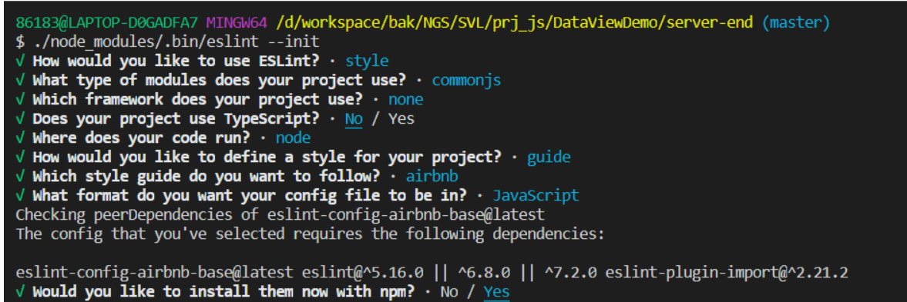

# ESlint Step to use

 - 1、install VSCode extension ESlint (For IED real time check)
 - 2、install eslint in project
    ```
    npm install eslint --save-dev
    ```
  - 3、generate eslint config file
    ```
    ./node_modules/.bin/eslint --init 
    ```


    ```
    # Choose the third item (To check syntax, find problems, and enforce code style)
    # Then choose the second (CommonJS (require/exports))
    # And then choose the third item (None of these)
    # And then choose "No"
    # And then choose "Node" only ( use space key to select and unselect )
    # And then choose the first item ( Use a popular style guide )
    # And then choose the first item ( Airbnb )
    # And then choose the first item ( JavaScript )
    # And then choose "Yes" ( It`s will install dependencies and  generate config file)
    # END
    ```
    

  - 4、use eslint command check or fix js file 
    ```
    ./node_modules/.bin/eslint  app.js          (check)
    ./node_modules/.bin/eslint  dir/*           (check)
    ./node_modules/.bin/eslint --fix  app.js    (fix)
    ./node_modules/.bin/eslint --fix  dir/*     (fix)

    ```

## Details
### Install ESlint 
  ```
  npm install eslint -g
  npm install eslint --save-dev # in the project
  ```  
### Choose one base ESlint config
  - eslint-config-airbnb-base (npm for help and dependencies)
     npm install eslint-config-airbnb-base --save-dev
     # npm info "eslint-config-airbnb-base@latest" peerDependencies
     # install dependencies
  - eslint-config-standard (npm for help dependencies)
  - others

### Generate ESlint config file
  ```
  eslint --init # in the project
  # or
  ./node_modules/.bin/eslint --init
  ```
### IDE extension
  - vscode
    - ESlint

### Check js file
  - Manual check
  ```
    eslint file.js
    eslint dir/*
    eslint --fix file.js
    eslint --fix dir/*
  ```
  - IED and ESlint extension real time chec

### VSCode enable/disable ESlint
  ```
  ctrl + shift + p
  then type eslint
  and choose enable or disable ESlint
  ```