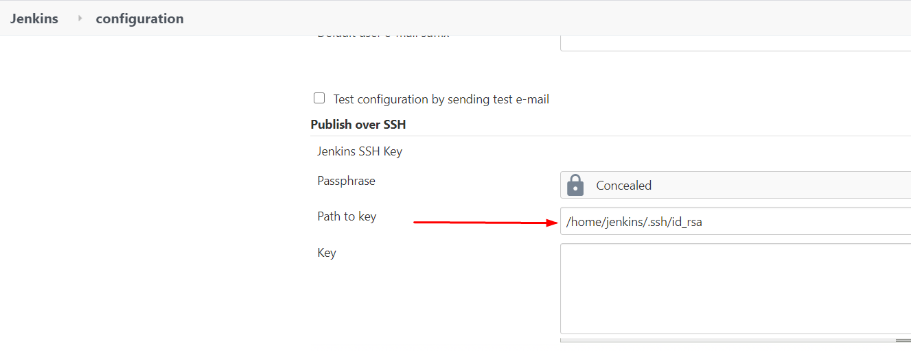
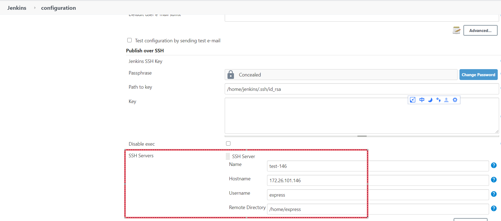
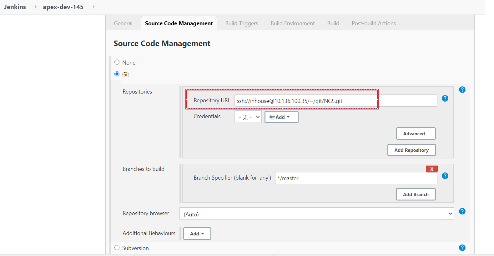
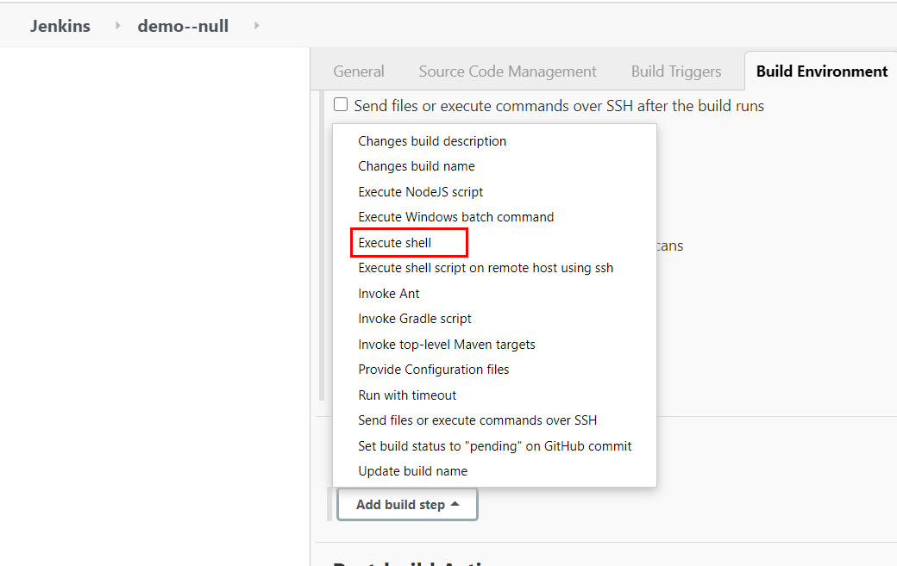
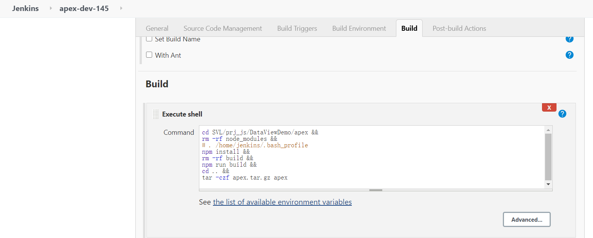
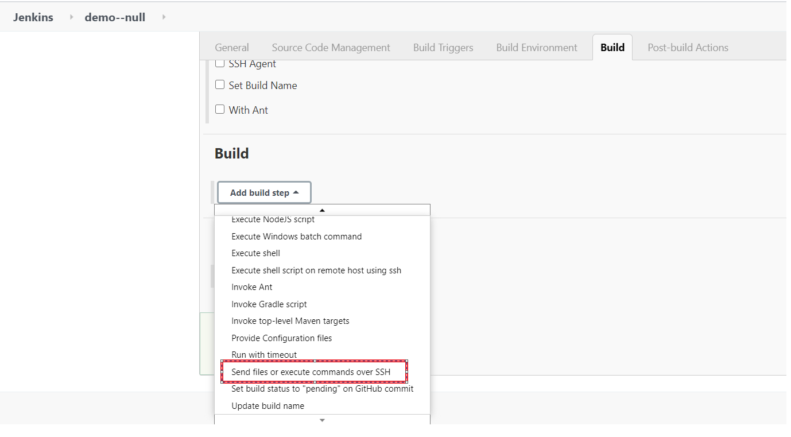
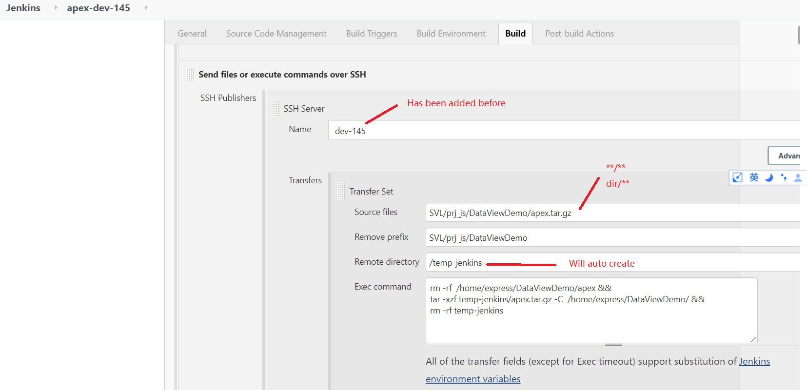

# Jenkins 

# Preparation
## 1，Generate RSA key pairs if not exist 

  ```bash
  ssh-keygen -m PEM -t rsa
  
  
  # Algorithm must be specified as RSA and PEM format, in most cases, this is the default，
  # But docker maybe not, and Jenkins need RSA and PEM format key.
  ```

## 2，Install Plugin  "Publish Over SSH" In Jenkins

## 3，Set Private Key Path In Jenkins
  - Manage Jenkins →  Configure System
  

## 4，Set SSH Login Server Without A Password

  ```bash
  # Copy public key to the server
  ssh-copy-id -i $HOME/.ssh/id_rsa.pub  express@172.26.101.146
  # Then test login express@172.26.101.146 without password
  # Same way copy the public key to other servers
  ```

## 5，Add Server In Jenkins
  - Manage Jenkins →  Configure System
  

## 6，Add The Public Key Into Git Server
This is use to Jenkins pull code without password.

# New Jenkins Item

## 1，Click New Item At Jenkins Home Page
## 2，Select Freestyle project With A Name
## 3，Set Git Repository URL
  

## 4，Add Build Step And Select  "Execute shell"
  

## 5，Typing Shell Commands  About Build Project
  

## 6， Add A  New Build Step And Choose "Send files or execute commands over SSH"
  

## 7, Config Remote Server Info And Typing Shell Commands That  Will Do At Remote Server
  