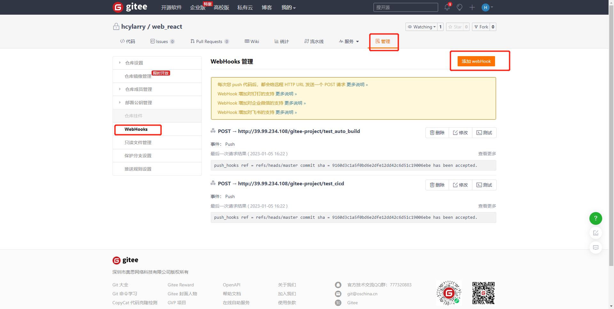

# Jenkins

## 安装部署初始化


### 创建Jenkins用户
  Jenkins 服务默认使用jenkins用户, 所以创建一个对应的账号方便后续操作。
  ```bash
  sudo useradd -m -s /bin/bash jenkins
  sudo passwd jenkins
  ```
  
### 生成密钥对
  - 使用jenkins账号生成密钥对，默认会保存在 `$HOME/.ssh` 目录下， 默认即可
  ```bash
  ssh-keygen -m PEM -t rsa -b 4096
  ```
  - 注意事项：RSA的密钥在 Ubuntu 22.04 中被认为是不安全的，需要修改sshd配置 `/etc/ssh/sshd_config` 添加如下内容 
  ```
  HostKeyAlgorithms +ssh-rsa
  PubkeyAcceptedKeyTypes +ssh-rsa
  ```
 - 这个密钥不仅会用在服务器的免密远程登录设置，还会用在git仓库的免密操作
 - 虽然 RSA 密钥被认为是不安全的，但是为了方便还是选用了RSA这种常用密钥，其他的还不熟悉怎么用

### 配置服务器免密登录
  - 使用 jenkins 用户
  - 不是必须的，但是一般来说都是需要的，如果代码要部署到的服务器跟Jenkins服务不是同一台服务器就必须要配置了，就需要配置Jenkins服务器与运行项目的服务器免密登录。
  - 使用jenkins用户操作
  ```
  ssh-copy-id -i $HOME/.ssh/id_rsa.pub username@172.16.10.XXX
  # 用户名和IP就是运行项目那台服务器的用户名和IP，根据提示输入运行项目那台服务器的用户名对应的密码确认即可，跟 ssh 的远程登录类似。
  ```
  - 使用 `ssh username@172.16.10.XXX` 不输入密码可以登录成功即配置成功
  - 多台服务器的话每台都要同样的操作配置

### 配置git仓库免密操作
  - 使用 jenkins 用户
  - 登录到 git 仓库托管平台，在设置中找到SSH密钥，把 `$HOME/.ssh/id_rsa.pub` 的内容添加进去即可。
  
  - 配置成功后，可以不输入密码直接操作 git 仓库中的代码，可以试试 `git clone XXX`

### 安装注意
  - 暂时不推荐使用 docker 的方式安装部署，安装配置的过程中有些操作需要重启服务，但是使用 docker 安装部署的服务，服务重启异常。不是说 docker 的方式不行，可能资料较少，有些坑比较深。
  - 需要Java 环境，有Java项目还需要安装 maven
  - 需要安装 git
  - 根据需要 nodejs , npm, yarn，gcc 等

### 用户权限管理
  默认是没有用户角色的权限控制，需要安装插件 `Role-based Authorization Strategy`, 同时在 `Configure Global Security` 中的认证方式选择 `Role-based Strategy`

### 插件扩展
  初始化是选择推荐安装的插件外，还需要 `Publish Over SSH` ，`Gitee` ，`Git Parameter Plug-In` 等，插件有可能会遇到网络错误，网上也有方式换源。


## 服务器管理
  上面的步骤已经配置了服务器的免密登录，还需把服务器信息添加到 Jenkins 中进行管理。

### 添加服务器
  - 在系统设置 `Configure System` 中找到 `Publish over SSH` 配置 Jenkins 密钥，这里的密钥就是前面步骤使用 jenkins 用户生成的密钥对中的私钥
  
  - `SSH Servers` 下添加 SSH 服务器，就是前面步骤配置的免密登录的运行项目的服务器，有几台添加几台。
  
  - 在项目配置中可以选择要部署到的服务器
  


## 项目管理

### 项目分组
  - 项目多了只有可能比较乱，推荐分组。
  - 创建项目时，先选分组，然后创建项目默认就是在选中的分组中，也可以在分组配置中修改项目分组。
  - 分组
  
  - 创建
  
  - 配置
  

### 项目配置
  - Jenkins 构建部署项目的方式有多种，选择自己熟悉的。
  - 新建项目 `New Item`, 类型主要有 `Freestyle project` 和 `Pipeline` 两种。
  - 以 `Freestyle project` 为例
  - 新建项目
   
  - 项目 General 配置，一般来说保持默认就行，或者在 Description 中写一些描述信息即可，如果需要参数化构建需要勾选 `This project is parameterised` 然后选择参数类型添加参数。参数化构建还挺重要的，后面单独说。
  
  - 项目代码源配置，填写 git 仓库的 ssh 地址，前面已经配置了 git 仓库的免密操作了，需要注意的是免密的配置是跟 git 用户相关的，如果说 git 用户没有项目权限，那么Jenkins 也操作不了 git 仓库
  
  - 根据实际情况设置代码分支
  
  - `Build Triggers` 和 `Build Environment` 一般不需要设置，如果需要跟 git 仓库的源码平台联动实现自动化部署，则需要安装对应插件，然后做相关配置，这个稍后单独说。
  - 项目 `Build Steps` 配置，这个就是最核心的部分，决定了怎么构建部署项目
  
  _ 项目 `Build Steps` 中 `Execute shell` 设置，就是构建项目的一些Shell命令，根据具体的项目填写。
  

  - 项目 `Build Steps` 中 `Send files or execute commands over SSH`, 最需要注意的就是文件路径，可以先简单配置，然后执行后到服务器上看看跟预期是否一致。
  


### 参数化构建
  - 参数化构建是说可以在构建项目的时候带一个参数，因为有些项目可能大部分都一样，只有很少一部分不同，那如果每个都对应一个Jenkins项目就显得有些啰嗦，比如可以设置一个 git 分支的参数，这样构建的时候就可以选择分支构建，不用每个分支都创建一个Jenkins项目。\
  - 选则参数化构建
  
  - 设置参数值
  
  - 项目配置中使用参数
  
  - 构建时选择参数
  

### 自动化构建
  - 自动化构建就是跟 git 仓库托管平台联动，当推送代码到代码仓库时或者PR时，触发 Jenkins 项目的构建。
  - 以 Gitee 为例
  - 申请 Aaccess Token `https://gitee.com/profile/personal_access_tokens`, 根据提示申请即可，保存好 token 稍后添加到 Jenkins 中。
  
  - 在 Jenkins 证书管理添加申请到的 gitee token， 添加之后项目中就可以使用了
  
  - 在项目构建配置中勾选 `Build when a change is pushed to Gitee. ` 并配置。
  
  
  - 在源码管理中设置相关配置，项目细节参考 gitee 文档 `https://gitee.com/help/articles/4193`
  
  - 在 gitee 上配置 webhook
  
  

## 内网环境补充

### 代码仓库添加 jenkins 账号
  - Jenkins 服务器上需要拉代码，所以在代码仓库平台中添加了一个共用的 jenkins 账号，并添加了Jenkins服务器上ssh 公钥，以保证代码拉取正常。
  - 代码仓库平台中的共用 jenkins 账号需要有项目代码仓库权限，如果是要自动化部署，需要有设置webhook的权限，一般需要 master 权限 或者 owner。

### 企业微信通知
  - 添加了企业微信消息推送的插件
  - 在企业微信中新建一个机器人并保存 webhook 地址
  - 在 Jenkins 项目中配置构建信息推送


