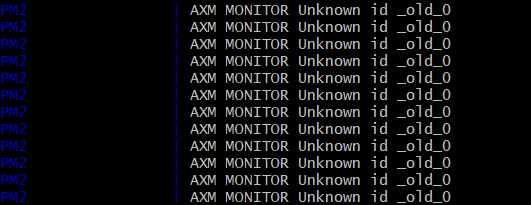

# pm2 
## pm2 tab 自动补全
  * pm2 completion install
  * source ~/.bash_profile
## pm2 版本升级
  * npm install pm2 -g && pm2 update
  * pm2 update 是必要的，以便刷新pm2的守护进程。
## 生成配置文件模板
  * pm2 init  
  * 生成一个 ecosystem.config.js 模版
  * 可以通过配置文件来管理应用程序（start、stop、reload、restart）
    * pm2 start ecosystem.config.js
  * 可以 --only <app_name> 参数来指定具体的应用程序
    * pm2 restart ecosystem.config.js --only app
### 配置文件中的环境变量设置和使用
  * 可以声明多个环境变量条目，格式必须遵守 env_<environment-name>
  * 使用--env参数指定使用的环境变量条目
    * pm2 start ecosystem.config.js  （ 默认 ：env ）
    * pm2 start ecosystem.config.js --env production （ 指定production ： env_production） 
  ```text
  module.exports = {
    apps : [{
      name: "app",
      script: "./app.js",
      env: {
        NODE_ENV: "development",
      },
      env_production: {
        NODE_ENV: "production",
      }
    }]
  }
  ```
####  环境变量加载后不可变
  * 默认情况下环境变量加载到pm2进程后不再改变，以确保重起时的一致性
  * 强制更新环境变量，必须使用 --update-env 参数
    * pm2 restart ecosystem.config.js --update-env （ 刷新环境变量 ） 
    * pm2 restart ecosystem.config.js --env production --update-env （切换环境变量）
## 进程管理
  * pm2 start app.js (启动进程)
  * pm2 ls     （查看进程列表）
  * pm2 restart app
  * pm2 reload app
  * pm2 stop app
  * pm2 delete app
  * 一次指定多个应用
    * pm2 restart app1 app2 app3
  * 使用正则表达式  
    * pm2 restart /app/
  * pm2 save （保存进程列表）
  * pm2 resurrect （恢复保存的进程列表）  
## 本地监控 （控制台展示 CPU 和内存 使用情况）
  * pm2 monit   
## 日志管理
  * pm2 logs (所有的日志)
  * pm2 logs app1 (app1 的日志)
  * pm2 flush （清空所有日志）
  * 日志相关配置
  ```text
  module.exports = {
    apps: [{
        name: 'app',
        script: 'app.js',
        output: './out.log',
        error: './error.log',
        log: './combined.outerr.log',
        merge_logs: true,
      }]
  }
  ```
  * output 只是标准输出（console.log）
  * error 只是错误输出（console.error）
  * log 结合output和error，默认是禁用状态
  * merge_logs 合并日志，在集群模式下对同一程序的多个实例的日志合并到单个文件，默认是分开的
  * 禁用日志（将输出文件位置指定到空设备 /dev/null）
  ```text
  module.exports = {
    apps: [{
        name: 'app',
        script: 'app.js',
        output: '/dev/null',
        error: '/dev/null',
      }]
  }
  ```
  * 日志输出形式（可以是JSON）
    * "log_type": "json"
  * 日志的日期格式
    * "date_log_format" : "YYYY-MM-DD"  ( 遵循 moment.js )
### pm2 日志 与 log4js 一起使用
  * pm2 使用集群模式的情况！！！
  * 默认情况下log4js的日志丢失。
  * 设置 log4js 配置项
  ```js
  let log4js = require('log4js');

  log4js.configure({
    pm2: true,
    // pm2InstanceVar: 'INSTANCE_ID',
    pm2InstanceVar: 'NODE_APP_INSTANCE',

    appenders: {
      // out: { type: "stdout" }
      out: { type: "file", filename:'pm2logs.log'}
    },
    categories: {
      default: {
        appenders: ["out"],
        level: "info"
      }
    }
  })  
  ```
  * 安装 pm2 附加模块 pm2-intercom（进程间通信），不安装的情况下只有第一个实例的日志正常，其他丢失。
  ```bash
  pm2 install pm2-intercom
  ```
  * https://github.com/log4js-node/log4js-node/issues/265

## 启动钩子
  * 启动钩子的目的，保存进程列表，并在计算机重启甚至出现意外时将其恢复。
  * pm2 save （保存当前的进程列表）
  * pm2 startup （生成自动启动命令）
  ```bash
  sudo env PATH=$PATH:/home/Larry/.nvm/versions/node/v6.11.0/bin /home/Larry/.nvm/versions/node/v6.11.0/lib/node_modules/pm2/bin/pm2 startup systemd -u Larry --hp /home/Larry
  ```
  * 根据pm2 startup命令的输出提示执行生成的自动启动命令 (执行命令会生成一个自启动服务，如果想要定制服务名称可以在执行命令时再加一个参数 --service-name <name> )，参数 -u 指定用户名，参数--hp指定用户的home目录 （ -u <username> --hp <user_home> ）
  * sudo pm2 unstartup (取消自动启动)
  * sudo pm2 unstartup  --service-name <name> ( 指定服务名称的情况 )
  * 在使用NVM进行node版本管理时，当跟新node版本时要同时跟新运行 pm2 startup 命令
## pm2 负载均衡
  * 使用集群模式启动程序
    * pm2 start app.js -i <number-instances>
    * <number-instances> 可以是负数、0 、正整数、max
    * 负数的情况：  -1 表示 启动的实例个数是 CPU 核心数 -1
    * 0 等加于 max： 表示 有几个CPU 就启动几个应用实例
    * 正整数： 启动指定个数的应用实例，5 表示5个，10 表示10个。。。
  * 使用配置文件设置实例个数
  ```js
  module.exports = {
    apps: [{
      script: "app.js",
      instances: "max",
    }]
  }
  ```
### 集群模式下，要确保应用是无状态的，即不要保存数据在进程中
  * 不要保存 session 
  * 不要存储 websocket 连接
  * 使用 redis 等数据库 存储、共享 进程间状态
###   pm2 restart VS pm2 reload
  * 使用 restart 时，pm2 杀死所有进程并重启，所以会出现服务短时间无法使用
  * 使用 reload 时，pm2 重启所有进程，并始终保证至少有一个进程正在运行
  ```bash
  pm2 reload <app_name>
  pm2 reload ecosystem.config.js
  pm2 reload ecosystem.config.js --only app
  ```
### 优雅的启动和关闭  
  * 为了确保所有的请求在重载中被正确处理，需要确保在关闭程序时，不存在没有处理完的请求。优雅的关闭应该在退出应用程序和关闭所有外部连接之前处理所有的剩余的请求。
  * 参考链接 https://pm2.io/doc/ch/runtime/best-practices/graceful-shutdown/
  * 服务在其生命周期内不可避免的要面临重启，部署、或者服务崩溃，这时候客户端就可能面临两个问题：
    * 现服务不可用503（停机时间）
    * 请求失败的情况。
  * pm2 集群模式和 reload 操作可以避免服务不可用
  * 优雅的关闭和重启可以避免请求失败的情况
#### 优雅的关闭
  * 优雅的关闭必须经过5个步骤：
    * 收到停止的通知
    * 要求负载均衡器停止接收请求  
    * 完成所有正在进行的请求
    * 释放所有资源（数据库，队列…）
    * 退出
  * 举例
  ```js
  const app = express()
  const port = process.env.port || 8000

  app.get('/', (req, res) => { res.end('Hello world') })

  const server = require('http').createServer(app)
  server.listen(port, () => {
    console.log('Express server listening on port ' + server.address().port)
  })

  process.on('SIGINT', () => {
    console.info('SIGINT signal received.')

    // Stops the server from accepting new connections and finishes existing connections.
    server.close(function(err) {
      // if error, log and exit with error (1 code)
      if (err) {
        console.error(err)
        process.exit(1)
      }

      // close your database connection and exit with success (0 code)
      // for example with mongoose
      mongoose.connection.close(function () {
        console.log('Mongoose connection disconnected')
        process.exit(0)
      })
    })
  })  
  ```    
#### 设置超时终止
  * 默认情况下，如果应用没有自行退出，pm2 在发送 SIGKILL信号之前会等待1600毫秒。
  * 时间可以在配置文件中修改（单位毫秒）
  ```js
  module.exports = {
    apps: [{
      name: "app",
      script: "./app.js",
      kill_timeout: 1600,
    }]
  }  
  ```
### 优雅的启动
  * 在提供http请求之前，应用程序通常需要链接到数据库或其他资源，应用需要经过3个步骤来避免错误。
    * 打开数据库连接
    * 开始监听一个端口号
    * 通知pm2 应用程序已经就绪
  * 配置如下：
  ```js
  module.exports = {
    apps : [{
      name: "api",
      script: "./api.js",
      wait_ready: true,
      listen_timeout: 3000,
    }],
  }  
  ```
  * 默认情况下 3000 毫秒后，pm2 会认为 应用程序已经 ready，可以修改 listen_timeout字段来改变这个值。
  * e.g
  ```js
  const app = express()
  const port = process.env.port || 8000

  app.get('/', (req, res) => { res.end('Hello world') })

  const server = require('http').createServer(app)
  mongoose.connect('mongodb://mongosA:27501,mongosB:27501', (err) => {
    server.listen(port, () => {
      console.log('Express server listening on port ' + server.address().port)
      process.send('ready')
    })
  })  
  ```
### 集群环境变量
  * 默认情况下使用 NODE_APP_INSTANCE 环境变量区分集群。
  * 例如，只想在一个集群上运行定时任务，可以判断 process.env.NODE_APP_INSTANCE === 0是否成立。
  * 注意，process.env.NODE_APP_INSTANCE 取到的值跟pm2 ls 列出的实例ID不是对应关系，process.env.NODE_APP_INSTANCE 为0的实例是当前实例集群的第一个实例。
  * NODE_APP_INSTANCE 这个环境变量名可以被重命名。有时NODE_APP_INSTANCE会和其他node-config包产生命名冲突。
  ```js
  module.exports = {
    apps: [{
      name: "app",
      script: "./app.js",
      instance_var: "INSTANCE_ID",//重命名 NODE_APP_INSTANCE
    }]
  }
  ```

## pm2 自带的两个开发工具
### 观测和重启模式可观测当前目录以检测文件更改和自启动（监控文件修改后重启应用）
  ```js
  module.exports = {
    apps : [{
      name: "app",
      script: "./app.js",
      watch: true,
    }]
  }
  ```
  * 注意：观测和重启模式会导致硬重启，且不会发送SIGINT。
  * watch 的 值可以是：
    * true / false （true，观测当前目录）
    * string （观测路径）
    * array （一组观测路径）
  ```js
  module.exports = {
    apps : [{
      name: "app",
      script: "./app.js",
      watch: ".",
    }]
  }  
  ```  
  * ignore_watch 用于设置不观测的路径 （  chokidar：https://github.com/paulmillr/chokidar#path-filtering ）
    * string （路径）
    * array （一组路径）
  * watch_options 是作为chokidar依赖项的选项给出的对象（PM2使用的默认选项是持久稳固的，且ingoreInitial设置为true）
  * 在使用NFS设备时，您需要按照此chokidar（https://github.com/paulmillr/chokidar/issues/242）问题中的说明设置usePolling: true。
  * 使用 CLI 命令行工具 启用 观测
  ```bash
  pm2 start app.js --watch
  ```
  * 但是，请注意，启用 --watch时，您必须使用 pm2 stop  <app_name> --watch 来停止该进程，因为一般的停止不会使观测停止。
  * 这只是一个开发辅助工具，不要使用集群模式了吧，集群模式stop 后在重启监测就失效了。
  * pm2 restart <app_name> --watch
  * 好像并不太好用。
### HTTP 静态文件服务功能
  * pm2 serve <path> <port>
  * 由于默认值是 current folder 和 8080，您可以直接使用： pm2 serve
  * 在配置文件中设置
  * 可以 --name <name> 指定服务名称
  ```js
  module.exports = {
    apps: [{
      name: "static-file",
      script: "serve",
      env: {
        PM2_SERVE_PATH: ".",
        PM2_SERVE_PORT: 8080,
      },
    }]
  }
  ```
# error & kill
  
  ```
  pm2 kill
  pm2 start ecosystem.config.js
  ```
